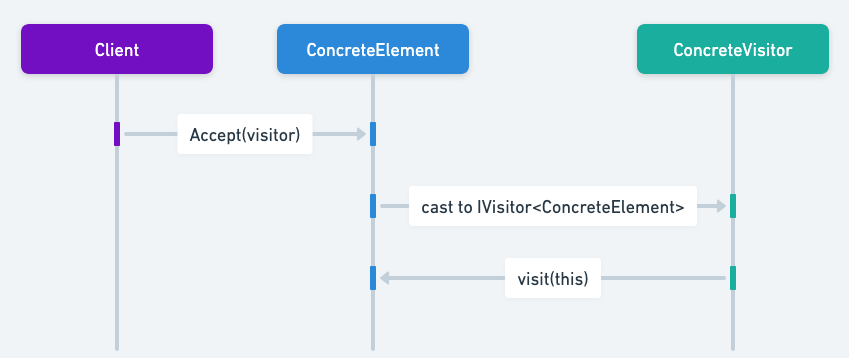

## هدف از الگوی طراحی Acyclic Visitor

الگوی Acyclic Visitor در جاوا عملیات را از سلسله مراتب اشیاء جدا می‌کند و طراحی انعطاف‌پذیری را برای کاربردهای مختلف ارائه می‌دهد.

## توضیح دقیق الگوی Acyclic Visitor با مثال‌های دنیای واقعی

مثال دنیای واقعی

> یک مثال مشابه دنیای واقعی از الگوی Acyclic Visitor در جاوا، سیستم راهنمای موزه است که کاربرد عملی این الگوی طراحی را نشان می‌دهد. تصور کنید موزه‌ای با نمایشگاه‌های مختلف مانند نقاشی‌ها، مجسمه‌ها و آثار تاریخی وجود دارد. موزه دارای انواع مختلفی از راهنماها (راهنمای صوتی، راهنمای انسانی، راهنمای واقعیت مجازی) است که اطلاعاتی را درباره هر نمایشگاه ارائه می‌دهند. به جای تغییر نمایشگاه‌ها هر بار که نوع جدیدی از راهنما معرفی می‌شود، هر راهنما یک رابط را برای بازدید از انواع مختلف نمایشگاه‌ها پیاده‌سازی می‌کند. به این ترتیب، موزه می‌تواند انواع جدیدی از راهنماها را بدون تغییر نمایشگاه‌های موجود اضافه کند و اطمینان حاصل کند که سیستم بدون ایجاد چرخه‌های وابستگی قابل گسترش و نگهداری است.

به زبان ساده

> الگوی Acyclic Visitor اجازه می‌دهد توابع به سلسله مراتب کلاس‌های موجود اضافه شوند بدون اینکه این سلسله مراتب تغییر کنند.

تعریف سایت [WikiWikiWeb](https://wiki.c2.com/?AcyclicVisitor)

> الگوی Acyclic Visitor اجازه می‌دهد توابع جدید به سلسله مراتب کلاس‌های موجود اضافه شوند بدون اینکه این سلسله مراتب تحت تأثیر قرار گیرند و بدون ایجاد چرخه‌های وابستگی که در الگوی بازدیدکننده‌ی(Visitor) GangOfFour ذاتی هستند.

نمودار توالی




## مثال برنامه‌نویسی از Acyclic Visitor در جاوا

در این مثال جاوا، ما یک سلسله مراتب از کلاس‌های مودم داریم که الگوی Acyclic Visitor را نشان می‌دهند. مودم‌های این سلسله مراتب باید توسط یک الگوریتم خارجی بر اساس معیارهای فیلتر (آیا مودم سازگار با یونیکس یا DOS است) بازدید شوند.

در اینجا سلسله مراتب `Modem` آورده شده است.

```java
public abstract class Modem {
        public abstract void accept(ModemVisitor modemVisitor);
}

public class Zoom extends Modem {

         // Other properties and methods...

        @Override
        public void accept(ModemVisitor modemVisitor) {
                if (modemVisitor instanceof ZoomVisitor) {
                        ((ZoomVisitor) modemVisitor).visit(this);
                } else {
                        LOGGER.info("Only ZoomVisitor is allowed to visit Zoom modem");
                }
        }
}

public class Hayes extends Modem {

        // Other properties and methods...

        @Override
        public void accept(ModemVisitor modemVisitor) {
                if (modemVisitor instanceof HayesVisitor) {
                        ((HayesVisitor) modemVisitor).visit(this);
                } else {
                        LOGGER.info("Only HayesVisitor is allowed to visit Hayes modem");
                }
        }
}
```

سپس، سلسله مراتب `ModemVisitor` را معرفی می‌کنیم.

```java
public interface ModemVisitor {
}

public interface HayesVisitor extends ModemVisitor {
        void visit(Hayes hayes);
}

public interface ZoomVisitor extends ModemVisitor {
        void visit(Zoom zoom);
}

public interface AllModemVisitor extends ZoomVisitor, HayesVisitor {
}

public class ConfigureForDosVisitor implements AllModemVisitor {

        // Other properties and methods...

        @Override
        public void visit(Hayes hayes) {
                LOGGER.info(hayes + " used with Dos configurator.");
        }

        @Override
        public void visit(Zoom zoom) {
                LOGGER.info(zoom + " used with Dos configurator.");
        }
}

public class ConfigureForUnixVisitor implements ZoomVisitor {

        // Other properties and methods...

        @Override
        public void visit(Zoom zoom) {
                LOGGER.info(zoom + " used with Unix configurator.");
        }
}
```

در نهایت، بازدیدکنندگان در عمل آورده شده‌اند.

```java
public static void main(String[] args) {
        var conUnix = new ConfigureForUnixVisitor();
        var conDos = new ConfigureForDosVisitor();

        var zoom = new Zoom();
        var hayes = new Hayes();

        hayes.accept(conDos); // Hayes modem with Dos configurator
        zoom.accept(conDos); // Zoom modem with Dos configurator
        hayes.accept(conUnix); // Hayes modem with Unix configurator
        zoom.accept(conUnix); // Zoom modem with Unix configurator   
}
```

خروجی برنامه:

```
09:15:11.125 [main] INFO com.iluwatar.acyclicvisitor.ConfigureForDosVisitor -- Hayes modem used with Dos configurator.
09:15:11.127 [main] INFO com.iluwatar.acyclicvisitor.ConfigureForDosVisitor -- Zoom modem used with Dos configurator.
09:15:11.127 [main] INFO com.iluwatar.acyclicvisitor.Hayes -- Only HayesVisitor is allowed to visit Hayes modem.
09:15:11.127 [main] INFO com.iluwatar.acyclicvisitor.ConfigureForUnixVisitor -- Zoom modem used with Unix configurator.
```

## چه زمانی از الگوی Acyclic Visitor در جاوا استفاده کنیم

این الگو می‌تواند در موارد زیر استفاده شود:

* زمانی که نیاز دارید یک تابع جدید به یک سلسله مراتب موجود اضافه کنید بدون اینکه نیاز به تغییر یا تأثیرگذاری بر آن سلسله مراتب باشد.
* زمانی که توابعی وجود دارند که بر روی یک سلسله مراتب عمل می‌کنند اما به آن سلسله مراتب تعلق ندارند. به عنوان مثال، ConfigureForDOS / ConfigureForUnix / ConfigureForX.
* زمانی که نیاز دارید عملیات بسیار متفاوتی بر روی یک شیء بسته به نوع آن انجام دهید.
* زمانی که سلسله مراتب کلاس بازدید شده به طور مکرر با مشتقات جدید از کلاس Element گسترش می‌یابد.
* زمانی که کامپایل مجدد، لینک مجدد، آزمایش مجدد یا توزیع مجدد مشتقات Element بسیار گران است.

## آموزش‌های الگوی Acyclic Visitor جاوا

* [الگوی Acyclic Visitor (Code Crafter)](https://codecrafter.blogspot.com/2012/12/the-acyclic-visitor-pattern.html)

## مزایا و معایب الگوی Acyclic Visitor

مزایا:

* قابل گسترش: عملیات جدید می‌توانند به راحتی بدون تغییر ساختار شیء اضافه شوند.
* جداشده (Decoupled): وابستگی بین اشیاء و عملیات روی آن‌ها را کاهش می‌دهد.
* بدون چرخه‌های وابستگی: وابستگی‌های غیر چرخه‌ای را تضمین می‌کند، نگهداری را بهبود می‌بخشد و پیچیدگی را کاهش می‌دهد.

معایب:

* پیچیدگی افزایش یافته: می‌تواند پیچیدگی بیشتری با نیاز به رابط‌های بازدیدکننده متعدد معرفی کند.
* سربار نگهداری: تغییر سلسله مراتب اشیاء نیاز به به‌روزرسانی تمام بازدیدکنندگان دارد.

## الگوهای طراحی مرتبط در جاوا

> * الگوی [Composite](https://java-design-patterns.com/patterns/composite/): اغلب همراه با Acyclic Visitor استفاده می‌شود تا امکان برخورد یکنواخت با اشیاء منفرد و ترکیبات را فراهم کند.
> * الگوی [Decorator](https://java-design-patterns.com/patterns/decorator/): می‌تواند در کنار Acyclic Visitor برای افزودن مسئولیت‌ها به اشیاء به صورت پویا استفاده شود.
> * الگوی [Visitor](https://java-design-patterns.com/patterns/visitor/): الگوی Acyclic Visitor یک نوع از الگوی بازدیدکننده است که از چرخه‌های وابستگی اجتناب می‌کند.

## منابع و اعتبارات

* [Design Patterns: Elements of Reusable Object-Oriented Software](https://amzn.to/3w0pvKI)
* [Head First Design Patterns: Building Extensible and Maintainable Object-Oriented Software](https://amzn.to/49NGldq)
* [Java Design Patterns: A Hands-On Experience with Real-World Examples](https://amzn.to/3yhh525)
* [Patterns in Java: A Catalog of Reusable Design Patterns Illustrated with UML](https://amzn.to/4bOtzwF)
* [Acyclic Visitor (Robert C. Martin)](http://condor.depaul.edu/dmumaugh/OOT/Design-Principles/acv.pdf)
* [Acyclic Visitor (WikiWikiWeb)](https://wiki.c2.com/?AcyclicVisitor)
